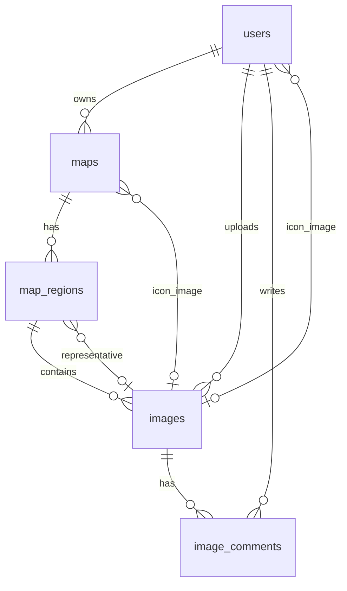

# AGENTS.md

## 概要

このプロジェクトは **Compose Multiplatform (CMP) / Kotlin Multiplatform (KMP)** で実装されるアプリである。  
バックエンドは（例: Supabase + PostgreSQL）を想定し、データは RLS（Row Level Security）で保護する。

---

## 仕様整理（現時点）

### 認証・ユーザー

- ユーザーは **Google / Apple** で認証する。
- DB 上の `users.id` は認証基盤の UID（例: `auth.uid()`）をそのまま用いる。
- ユーザーは以下を保持する。
    - ユーザーが設定できる表示名（display_name）
    - システム側で自動生成する短い一意ID（handle, 重複不可）
    - アイコン画像（images 参照）

### マップ

- ユーザーは **複数のマップ** を作成できる（User : Map = 1 : N）。
- マップは「国」と「特定の地域」を対象にする。
    - GeoBoundary などの外部サービス連携を想定し、DB には **外部ID（文字列）** を保存する。
    - 境界（GeoJSON等）はクライアント側で API 取得し、DB では保持しない（現時点）。
- マップは以下を保持する。
    - タイトル / 説明
    - アイコン画像（images 参照）
    - 対象地域（root_boundary_external_id）
    - 国コード（country_code: 任意）

### 地域への投稿（画像 + コメント）

- マップ編集画面で、マップ対象地域内の「ある地域単位」に対して **画像とコメント** を投稿できる。
    - 例: 日本マップ → 東京都に投稿 / 東京マップ → 練馬区に投稿
- 「地域単位」は GeoBoundary の外部ID（boundary_external_id）で識別する。
- 投稿画像の中から、地図表示時に使う **代表画像** を地域ごとに 1枚選べる。

### コメント

- **1枚の画像に対してコメントは複数** 投稿可能。
- コメントは、投稿者・対象画像・本文・投稿日時を保持する。

### 画像メタデータ

- 画像は撮影日時（taken_at）や撮影場所（taken_lat/taken_lng）などのメタデータを保存可能。
- EXIF などの追加メタは `exif (jsonb)` として保存可能。

---

## データモデル（テーブル関係）

### ER（概念）



### 補足

- GeoBoundary の詳細（境界形状/名称/階層など）はクライアントが外部 API から取得する。
- DB は外部IDの文字列（`root_boundary_external_id`, `boundary_external_id`）のみを保持する。

---

## テーブル定義（DDL）と RLS（現行・シンプル）

> 方針: **「自分のデータだけ」** を触れるようにする。  
> 公開/共有は将来拡張として後回しにできるよう、RLS は極力シンプルにしている。

### users

```sql
-- TABLE
CREATE TABLE users (
    id UUID PRIMARY KEY,
    handle TEXT NOT NULL UNIQUE,
    display_name TEXT NOT NULL,
    icon_image_id UUID NULL,
    created_at TIMESTAMPTZ NOT NULL DEFAULT NOW(),
    updated_at TIMESTAMPTZ NOT NULL DEFAULT NOW()
);

-- RLS
ALTER TABLE users ENABLE ROW LEVEL SECURITY;

CREATE POLICY users_select_own
ON users
FOR SELECT
USING (id = auth.uid());

CREATE POLICY users_update_own
ON users
FOR UPDATE
USING (id = auth.uid())
WITH CHECK (id = auth.uid());
```

### maps

```sql
-- TABLE
CREATE TABLE maps (
    id UUID PRIMARY KEY DEFAULT gen_random_uuid(),
    owner_user_id UUID NOT NULL REFERENCES users(id) ON DELETE CASCADE,
    root_boundary_external_id TEXT NOT NULL,
    country_code TEXT NULL,
    title TEXT NOT NULL,
    description TEXT NULL,
    icon_image_id UUID NULL,
    created_at TIMESTAMPTZ NOT NULL DEFAULT NOW(),
    updated_at TIMESTAMPTZ NOT NULL DEFAULT NOW()
);

-- RLS
ALTER TABLE maps ENABLE ROW LEVEL SECURITY;

CREATE POLICY maps_owner_all
ON maps
FOR ALL
USING (owner_user_id = auth.uid())
WITH CHECK (owner_user_id = auth.uid());
```

### map_regions

```sql
-- TABLE
CREATE TABLE map_regions (
    id UUID PRIMARY KEY DEFAULT gen_random_uuid(),
    map_id UUID NOT NULL REFERENCES maps(id) ON DELETE CASCADE,
    boundary_external_id TEXT NOT NULL,
    representative_image_id UUID NULL,
    created_at TIMESTAMPTZ NOT NULL DEFAULT NOW(),
    updated_at TIMESTAMPTZ NOT NULL DEFAULT NOW(),
    UNIQUE (map_id, boundary_external_id)
);

-- RLS
ALTER TABLE map_regions ENABLE ROW LEVEL SECURITY;

CREATE POLICY map_regions_owner_all
ON map_regions
FOR ALL
USING (
    EXISTS (
        SELECT 1 FROM maps
        WHERE maps.id = map_regions.map_id
          AND maps.owner_user_id = auth.uid()
    )
)
WITH CHECK (
    EXISTS (
        SELECT 1 FROM maps
        WHERE maps.id = map_regions.map_id
          AND maps.owner_user_id = auth.uid()
    )
);
```

### images

```sql
-- TABLE
CREATE TABLE images (
    id UUID PRIMARY KEY DEFAULT gen_random_uuid(),
    uploader_user_id UUID NOT NULL REFERENCES users(id) ON DELETE CASCADE,
    map_region_id UUID NULL REFERENCES map_regions(id) ON DELETE CASCADE,
    storage_key TEXT NOT NULL,
    content_type TEXT NULL,
    file_size BIGINT NULL,
    width INTEGER NULL,
    height INTEGER NULL,
    taken_at TIMESTAMPTZ NULL,
    taken_lat DOUBLE PRECISION NULL,
    taken_lng DOUBLE PRECISION NULL,
    exif JSONB NULL,
    created_at TIMESTAMPTZ NOT NULL DEFAULT NOW()
);

-- RLS
ALTER TABLE images ENABLE ROW LEVEL SECURITY;

CREATE POLICY images_uploader_all
ON images
FOR ALL
USING (uploader_user_id = auth.uid())
WITH CHECK (uploader_user_id = auth.uid());
```

### image_comments

```sql
-- TABLE
CREATE TABLE image_comments (
    id UUID PRIMARY KEY DEFAULT gen_random_uuid(),
    image_id UUID NOT NULL REFERENCES images(id) ON DELETE CASCADE,
    author_user_id UUID NOT NULL REFERENCES users(id) ON DELETE CASCADE,
    body TEXT NOT NULL,
    created_at TIMESTAMPTZ NOT NULL DEFAULT NOW(),
    updated_at TIMESTAMPTZ NULL,
    deleted_at TIMESTAMPTZ NULL
);

-- RLS
ALTER TABLE image_comments ENABLE ROW LEVEL SECURITY;

CREATE POLICY image_comments_author_all
ON image_comments
FOR ALL
USING (author_user_id = auth.uid())
WITH CHECK (author_user_id = auth.uid());
```

---

## Kotlin（CMP/KMP）実装メモ（後で追記）

> ここは後で Kotlin の実装（データモデル、Repository、Supabase クライアント、UI など）を追記するためのスペース。

### Data Models

- TODO:

### Repository / UseCases

- TODO:

### API / Storage（画像アップロード）

- TODO:

### UI（Compose Multiplatform）

- TODO:

---

## 今後の拡張候補（任意）

- 公開マップ / 共有機能を入れる場合の RLS 拡張
- representative_image_id の整合性（代表画像が同一 map_region に属することを保証する制約/トリガ）
- 画像の削除ポリシー（ソフトデリート運用 or 参照制約）
