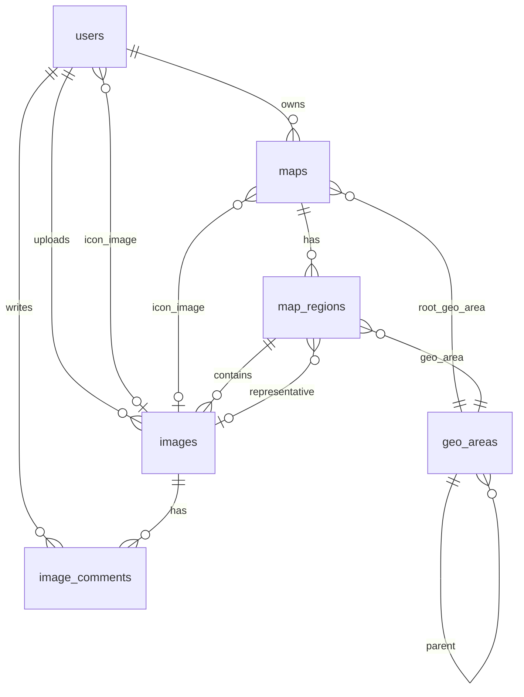

# データベース設計

## 概要

Supabase (PostgreSQL) を使用。PostGIS 拡張で地理情報を管理。

## ER図



## テーブル定義

### users

ユーザー情報。認証基盤の UID をそのまま `id` として使用。

| カラム           | 型           | 制約                      | 説明                 |
|---------------|-------------|-------------------------|--------------------|
| id            | UUID        | PK                      | ユーザーID（auth.uid()） |
| handle        | TEXT        | UNIQUE NOT NULL         | 一意の短いID            |
| display_name  | TEXT        | NOT NULL                | 表示名                |
| icon_image_id | UUID        | FK(images), NULL        | アイコン画像             |
| created_at    | TIMESTAMPTZ | NOT NULL, DEFAULT NOW() | 作成日時               |
| updated_at    | TIMESTAMPTZ | NOT NULL, DEFAULT NOW() | 更新日時               |

### geo_areas

地理エリアの自己参照階層テーブル。ADM0（国）〜ADM5 まで対応。

| カラム           | 型                            | 制約                            | 説明                            |
|---------------|------------------------------|-------------------------------|-------------------------------|
| id            | UUID                         | PK, DEFAULT gen_random_uuid() | 内部ID                          |
| parent_id     | UUID                         | FK(geo_areas), NULL           | 親エリア（ADM0 は NULL）             |
| level         | SMALLINT                     | NOT NULL, CHECK(0-5)          | 階層レベル（0=国, 1=都道府県, 2=市区町村...） |
| adm_id        | TEXT                         | NOT NULL                      | データソースの行政ID                   |
| country_code  | TEXT                         | NOT NULL                      | ISO 3166-1 alpha-2 国コード       |
| name          | TEXT                         | NOT NULL                      | デフォルト表示名                      |
| name_en       | TEXT                         | NULL                          | 英語名                           |
| name_ja       | TEXT                         | NULL                          | 日本語名                          |
| iso_code      | TEXT                         | NULL                          | ISO コード（例: ISO 3166-2）        |
| wikipedia     | TEXT                         | NULL                          | Wikipedia タグ（サムネイル取得用）        |
| thumbnail_url | TEXT                         | NULL                          | サムネイル URL                     |
| center        | GEOGRAPHY(POINT, 4326)       | NULL                          | 中心点                           |
| polygons      | GEOMETRY(MULTIPOLYGON, 4326) | NOT NULL                      | 境界ポリゴン                        |
| created_at    | TIMESTAMPTZ                  | NOT NULL, DEFAULT NOW()       | 作成日時                          |
| updated_at    | TIMESTAMPTZ                  | NOT NULL, DEFAULT NOW()       | 更新日時                          |

**インデックス**:

- `geo_areas_parent_id_idx` on `parent_id`
- `geo_areas_country_code_level_idx` on `(country_code, level)`
- `geo_areas_polygons_idx` (GIST) on `polygons`

**一意制約**:

- `geo_areas_adm_id_country_code_level_key` on `(adm_id, country_code, level)`

### maps

ユーザーが作成するマップコレクション。

| カラム              | 型           | 制約                            | 説明          |
|------------------|-------------|-------------------------------|-------------|
| id               | UUID        | PK, DEFAULT gen_random_uuid() | マップID       |
| owner_user_id    | UUID        | FK(users), NOT NULL           | 所有者         |
| root_geo_area_id | UUID        | FK(geo_areas), NOT NULL       | ルート地域（国や地域） |
| title            | TEXT        | NOT NULL                      | タイトル        |
| description      | TEXT        | NULL                          | 説明          |
| icon_image_id    | UUID        | FK(images), NULL              | アイコン画像      |
| created_at       | TIMESTAMPTZ | NOT NULL, DEFAULT NOW()       | 作成日時        |
| updated_at       | TIMESTAMPTZ | NOT NULL, DEFAULT NOW()       | 更新日時        |

### map_regions

マップ内の選択された地域。

| カラム                     | 型           | 制約                            | 説明      |
|-------------------------|-------------|-------------------------------|---------|
| id                      | UUID        | PK, DEFAULT gen_random_uuid() | リージョンID |
| map_id                  | UUID        | FK(maps), NOT NULL            | 親マップ    |
| geo_area_id             | UUID        | FK(geo_areas), NOT NULL       | 対象地域    |
| representative_image_id | UUID        | FK(images), NULL              | 代表画像    |
| created_at              | TIMESTAMPTZ | NOT NULL, DEFAULT NOW()       | 作成日時    |
| updated_at              | TIMESTAMPTZ | NOT NULL, DEFAULT NOW()       | 更新日時    |

**一意制約**:

- `map_regions_map_id_geo_area_id_key` on `(map_id, geo_area_id)`

### images

アップロードされた画像。

| カラム              | 型                | 制約                            | 説明           |
|------------------|------------------|-------------------------------|--------------|
| id               | UUID             | PK, DEFAULT gen_random_uuid() | 画像ID         |
| uploader_user_id | UUID             | FK(users), NOT NULL           | アップロードユーザー   |
| map_region_id    | UUID             | FK(map_regions), NULL         | 所属リージョン      |
| storage_key      | TEXT             | NOT NULL                      | Storage キー   |
| content_type     | TEXT             | NULL                          | MIME タイプ     |
| file_size        | BIGINT           | NULL                          | ファイルサイズ（バイト） |
| width            | INTEGER          | NULL                          | 幅（ピクセル）      |
| height           | INTEGER          | NULL                          | 高さ（ピクセル）     |
| taken_at         | TIMESTAMPTZ      | NULL                          | 撮影日時         |
| taken_lat        | DOUBLE PRECISION | NULL                          | 撮影緯度         |
| taken_lng        | DOUBLE PRECISION | NULL                          | 撮影経度         |
| exif             | JSONB            | NULL                          | EXIF メタデータ   |
| created_at       | TIMESTAMPTZ      | NOT NULL, DEFAULT NOW()       | 作成日時         |

### image_comments

画像に対するコメント。

| カラム            | 型           | 制約                            | 説明         |
|----------------|-------------|-------------------------------|------------|
| id             | UUID        | PK, DEFAULT gen_random_uuid() | コメントID     |
| image_id       | UUID        | FK(images), NOT NULL          | 対象画像       |
| author_user_id | UUID        | FK(users), NOT NULL           | 投稿者        |
| body           | TEXT        | NOT NULL                      | コメント本文     |
| created_at     | TIMESTAMPTZ | NOT NULL, DEFAULT NOW()       | 作成日時       |
| updated_at     | TIMESTAMPTZ | NULL                          | 更新日時       |
| deleted_at     | TIMESTAMPTZ | NULL                          | 削除日時（論理削除） |

## View

### geo_areas_view

`geo_areas` テーブルの GeoJSON 変換ビュー。クライアントが直接使用。

| カラム              | 型           | 説明                  |
|------------------|-------------|---------------------|
| id               | UUID        | エリアID               |
| parent_id        | UUID        | 親エリアID              |
| level            | SMALLINT    | 階層レベル               |
| adm_id           | TEXT        | 行政ID                |
| country_code     | TEXT        | 国コード                |
| name             | TEXT        | 表示名                 |
| name_en          | TEXT        | 英語名                 |
| name_ja          | TEXT        | 日本語名                |
| iso_code         | TEXT        | ISO コード             |
| wikipedia        | TEXT        | Wikipedia タグ        |
| thumbnail_url    | TEXT        | サムネイル URL           |
| center_geojson   | TEXT        | 中心点（GeoJSON 文字列）    |
| polygons_geojson | TEXT        | 境界ポリゴン（GeoJSON 文字列） |
| created_at       | TIMESTAMPTZ | 作成日時                |
| updated_at       | TIMESTAMPTZ | 更新日時                |

## RPC 関数

### upsert_geo_area

単一の geo_area を upsert。

```sql
upsert_geo_area(
    p_parent_id UUID,
    p_level SMALLINT,
    p_adm_id TEXT,
    p_country_code TEXT,
    p_name TEXT,
    p_name_en TEXT DEFAULT NULL,
    p_name_ja TEXT DEFAULT NULL,
    p_iso_code TEXT DEFAULT NULL,
    p_wikipedia TEXT DEFAULT NULL,
    p_thumbnail_url TEXT DEFAULT NULL,
    p_center_lat DOUBLE PRECISION DEFAULT NULL,
    p_center_lon DOUBLE PRECISION DEFAULT NULL,
    p_polygons_geojson JSONB DEFAULT NULL
) RETURNS UUID
```

### upsert_geo_areas_batch

geo_areas のバッチ upsert。

```sql
upsert_geo_areas_batch(p_areas JSONB) RETURNS JSONB
-- 戻り値: [{adm_id, id}, ...] のマッピング配列
```

### get_geo_areas_by_country

指定国のエリアを取得。

```sql
get_geo_areas_by_country(
    p_country_code TEXT,
    p_max_level SMALLINT DEFAULT NULL
) RETURNS SETOF geo_areas_view
```

### get_geo_areas_by_level

指定国・レベルのエリアを取得。

```sql
get_geo_areas_by_level(
    p_country_code TEXT,
    p_level SMALLINT
) RETURNS SETOF geo_areas_view
```

### get_geo_area_children

指定エリアの子エリアを取得。

```sql
get_geo_area_children(p_parent_id UUID) RETURNS SETOF geo_areas_view
```

### get_geo_area_descendants

指定エリアの子孫エリアを再帰取得。

```sql
get_geo_area_descendants(
    p_area_id UUID,
    p_max_depth SMALLINT DEFAULT 10
) RETURNS TABLE(...)
```

### get_geo_area_ancestors

指定エリアの祖先エリアを取得（ルートへのパス）。

```sql
get_geo_area_ancestors(p_area_id UUID) RETURNS TABLE(...)
```

### get_distinct_country_codes

登録済みの全国コードを取得。

```sql
get_distinct_country_codes() RETURNS TABLE(country_code TEXT)
```

## RLS ポリシー

RLS（Row Level Security）により、ユーザーは自分のデータのみ操作可能。

### users

| ポリシー             | 操作     | 条件                |
|------------------|--------|-------------------|
| users_select_own | SELECT | `id = auth.uid()` |
| users_insert_own | INSERT | `id = auth.uid()` |
| users_update_own | UPDATE | `id = auth.uid()` |

### geo_areas

| ポリシー                    | 操作     | 条件                 |
|-------------------------|--------|--------------------|
| geo_areas_select_public | SELECT | `true`（全ユーザー読み取り可） |

### maps

| ポリシー           | 操作  | 条件                           |
|----------------|-----|------------------------------|
| maps_owner_all | ALL | `owner_user_id = auth.uid()` |

### map_regions

| ポリシー                  | 操作  | 条件                     |
|-----------------------|-----|------------------------|
| map_regions_owner_all | ALL | 親マップの所有者が `auth.uid()` |

### images

| ポリシー                | 操作  | 条件                              |
|---------------------|-----|---------------------------------|
| images_uploader_all | ALL | `uploader_user_id = auth.uid()` |

### image_comments

| ポリシー                      | 操作  | 条件                            |
|---------------------------|-----|-------------------------------|
| image_comments_author_all | ALL | `author_user_id = auth.uid()` |
